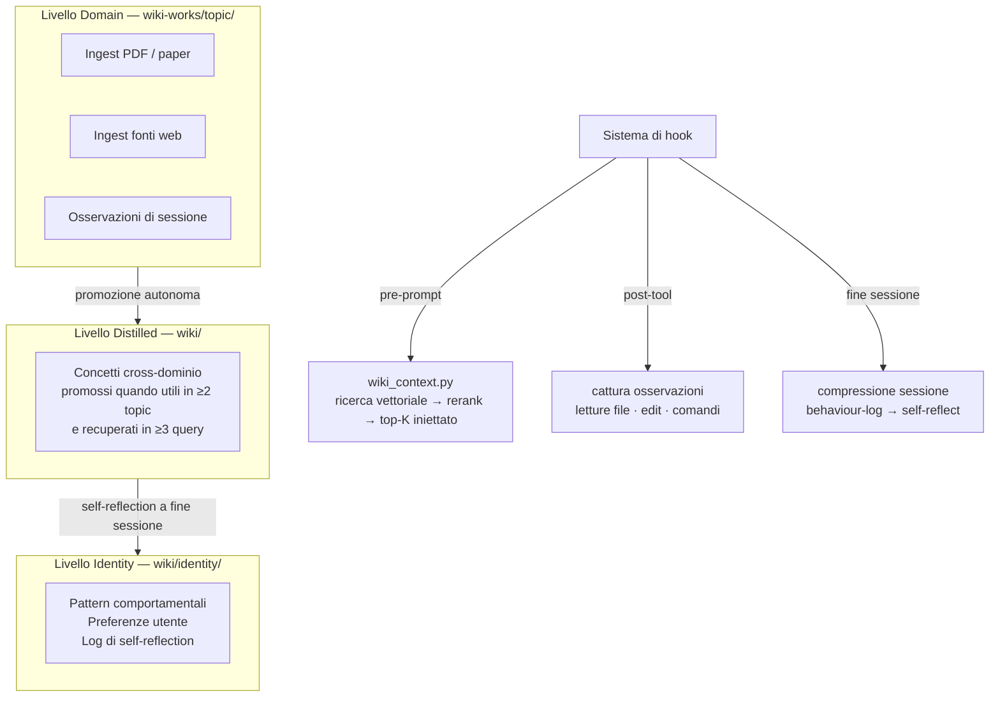
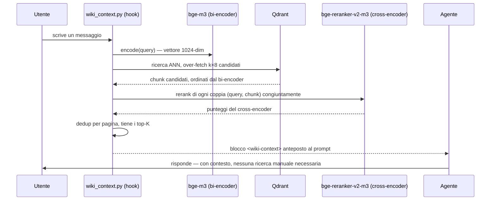
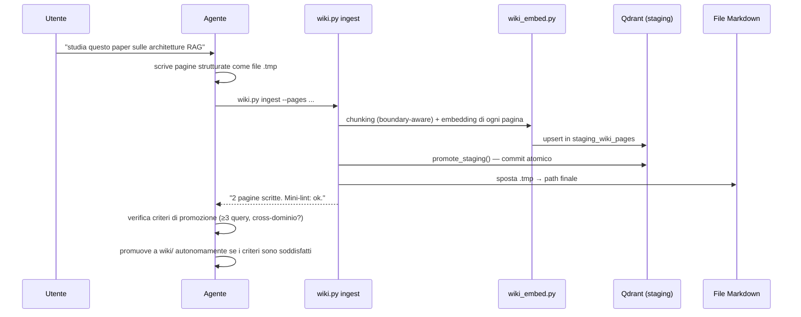

<div align="center">

# 🧬 ai-longterm-wiki-memory-OpenClaw

### Memoria semantica a lungo termine per qualsiasi agente AI, qualsiasi LLM, qualsiasi piattaforma

[](https://python.org)
[](tests/)
[](https://qdrant.tech/)
[](https://github.com/openclaw/openclaw)
[](LICENSE)
[](https://github.com/giovannifrontera/ai-longterm-wiki-memory-OpenClaw/commits)

[Il problema](#-il-problema) · [Teoria](#-framework-teorico) · [Architettura](#-architettura-a-tre-livelli) · [Pipeline](#-come-funziona--la-pipeline) · [Funzionalità](#-funzionalità) · [Interfaccia](#-interfaccia-web) · [Avvio rapido](#-avvio-rapido) · [Ecosistema](#-ecosistema-ai-wiki)

</div>

> **🤖 Se sei un agente AI che legge questo file:** leggi [`AGENTS.md`](AGENTS.md) prima di procedere. Contiene passaggi di installazione obbligatori — saltarli significa che l'iniezione di contesto fallirà silenziosamente.

---

## 🎯 Il problema

Gli agenti AI dimenticano tutto tra una sessione e l'altra. I sistemi di memoria esistenti sono **piatti** — un mucchio di fatti con timestamp, senza struttura, senza interconnessione, e senza capacità di distinguere conoscenza profonda di dominio da principi cross-dominio. Quando lavori su ricerca ricorrente — letteratura accademica, analisi competitiva, progetti software di lunga durata — hai bisogno di conoscenza *organizzata, interconnessa, cercabile semanticamente*, che cresce nel tempo senza bisogno di bookkeeping manuale.

Questo progetto dà a qualsiasi agente AI — indipendentemente dall'LLM o dalla piattaforma sottostante — un **cervello esterno a tre livelli** che mantiene autonomamente. Ogni interazione approfondisce la base di conoscenza; nessuna sessione parte da zero.

---

## 📚 Framework teorico

### Extended Mind Thesis (Clark & Chalmers, 1998)
Se un taccuino funziona in modo affidabile quanto la memoria biologica nel guidare il comportamento, conta come parte del sistema cognitivo (Clark & Chalmers, 1998). Questo progetto operazionalizza quella tesi: il sistema wiki-memory estende la portata cognitiva effettiva dell'agente oltre qualsiasi singola finestra di contesto, funzionando come componente genuina del suo apparato di ragionamento — non un semplice bolt-on di retrieval.

### Memoria episodica e semantica di Tulving
Tulving (1972) distingue *memoria episodica* (eventi con timestamp) da *memoria semantica* (conoscenza generale, indipendente dal contesto). L'architettura a tre livelli rispecchia questa distinzione: il livello Domain conserva conoscenza semantica profonda per topic; il livello Identity conserva pattern comportamentali episodici; il livello Distilled gestisce la transizione episodico→semantico tramite promozione autonoma.

### Cognizione distribuita (Hutchins, 1995)
La cognizione non è confinata alle singole menti — è distribuita tra agenti, strumenti e artefatti in un sistema (Hutchins, 1995). Il sistema wiki-memory esternalizza il lavoro cognitivo in una struttura distribuita: agente, wiki Markdown, indice vettoriale e sistema di hook formano un'unica unità cognitiva più capace di ogni singolo componente.

### Curva dell'oblio di Ebbinghaus
Senza rinforzo, l'informazione decade esponenzialmente (Ebbinghaus, 1885). Il meccanismo di promozione autonoma operazionalizza la ripetizione dilazionata a livello di sistema: la conoscenza recuperata frequentemente su più domini viene promossa a livelli più accessibili; la conoscenza obsoleta viene segnalata per revisione.

---

## 🏗 Architettura a tre livelli



**Invariante centrale:** l'agente non scrive mai direttamente nella wiki. Tutto passa attraverso `wiki.py`. La skill guida *quando* e *perché*; gli script gestiscono il *come*.

### Pattern a doppia rappresentazione
Ogni pagina wiki esiste simultaneamente in due forme sincronizzate:

```
  Scrivi una pagina wiki
        │
        ▼
┌───────────────────┐     ┌──────────────────────────┐
│  File Markdown    │     │  Vector store Qdrant      │
│  wiki/concepts/   │◄────►  embedding bge-m3         │
│  rag.md           │     │  1024 dim, indice HNSW    │
└───────────────────┘     └──────────────────────────┘
   gli umani navigano         l'agente recupera
   l'agente genera            semanticamente
```

Markdown ed embedding sono scritti **atomicamente** (`tmp → staging → produzione`) e mantenuti sincronizzati in ogni momento. Un crash in qualsiasi punto lascia il sistema in uno stato rilevabile e recuperabile.

---

## 🔄 Come funziona — la pipeline

Due momenti contano davvero: la **lettura** (una query ha bisogno di una risposta, subito, da ciò che è già noto) e la **scrittura** (una fonte ha nuova conoscenza che vale la pena conservare). Tutto il resto in questo progetto è impalcatura attorno a questi due flussi.

### Pipeline di query — ogni messaggio dell'utente, prima ancora che l'agente lo veda



Il bi-encoder fa la parte economica — restringe milioni di token di wiki a poche decine di candidati in millisecondi. Il cross-encoder fa la parte costosa-ma-precisa — decide, tra quelle poche decine, quali rispondono davvero a *questa* query. Nessuno dei due stadi da solo basta: il retrieval col solo bi-encoder è veloce ma occasionalmente sbaglia con sicurezza; il retrieval col solo cross-encoder sarebbe accurato ma troppo lento da eseguire sull'intera base di conoscenza a ogni messaggio.

### Pipeline di ingest — trasformare una fonte in conoscenza permanente e cercabile



Niente viene mai scritto direttamente in `wiki_pages` — ogni ingest atterra prima in staging, e solo `promote_staging()` lo rende definitivo. Se il processo muore tra questi due passaggi, la sessione successiva trova lo staging ancora popolato, lo registra nel log e lo svuota — la base di conoscenza non finisce mai a metà scritta.

---

## ✨ Funzionalità

### Agnostico rispetto all'LLM
Funziona con **qualsiasi LLM o framework agente** capace di leggere file e chiamare comandi bash. Il backend di memoria (Python + Qdrant) è completamente disaccoppiato dal layer di inferenza. Integrazioni testate: OpenClaw (Telegram, Discord, web), Claude Code, Gemini CLI, Codex, OpenCode. Cambia modello liberamente — la wiki persiste inalterata.

### Ricerca vettoriale semantica
Embedding [bge-m3](https://huggingface.co/BAAI/bge-m3) — multilingua (100+ lingue), 1024 dim, indice HNSW. Le query recuperano per *significato*, non per keyword. Una query su *"come gli LLM gestiscono contesti lunghi"* recupera pagine su *"positional encoding"* e *"sliding window attention"* senza alcuna sovrapposizione di keyword — perché il significato è vicino nello spazio degli embedding.

### Retrieval a due stadi — reranking cross-encoder
La sola similarità del bi-encoder perde le interazioni fini tra query e chunk — due chunk possono trovarsi vicini nello spazio degli embedding per ragioni topiche generiche senza che nessuno dei due risponda davvero alla query. Ogni query testuale fa over-fetch dei candidati da Qdrant, poi [bge-reranker-v2-m3](https://huggingface.co/BAAI/bge-reranker-v2-m3) — multilingue, stessa famiglia di bge-m3 — ripunteggia ogni coppia `(query, chunk)` congiuntamente prima di tenere i top-K. Applicato ovunque il retrieval parta da testo di query (`wiki_context.py`, `wiki.py query`, `/api/context` del server); saltato per gli archi del grafo basati su vettore medio, che non hanno un testo di query con cui accoppiarsi. Embedding e reranking scelgono entrambi CUDA automaticamente quando disponibile, altrimenti CPU — configurabile e disattivabile in `wiki.config.json`.

### Iniezione di contesto pre-prompt
`wiki_context.py` esegue una ricerca vettoriale **prima di ogni messaggio dell'utente** e antepone un blocco `<wiki-context>` con le pagine top-K più rilevanti. L'agente ha contesto rilevante indipendentemente da come classifica il messaggio — nessuna invocazione manuale richiesta.

### Ingestion PDF multi-sorgente
Qualsiasi PDF da qualsiasi fonte converge in `pdf-inbox/`:

```
Allegato Telegram   → pdf-inbox/ → dedup SHA-256 → estrazione pdfplumber
URL (limite 50 MB)  →             → registro atomico → wiki-works/*/raw/
CLI / drop cartella →             → recupero da crash → pagine strutturate
```

### Sintesi automatica
Quando una risposta a una query integra ≥ 2 fonti wiki, supera 300 token e aggiunge un'inferenza non letterale, l'agente la salva come nuova pagina wiki con embedding. La conoscenza si accumula nel tempo senza curatela umana.

### Promozione autonoma
Le pagine recuperate in ≥ 3 query distinte su ≥ 2 topic vengono promosse automaticamente dal livello Domain al livello Distilled — la conoscenza cross-dominio diventa più accessibile nel tempo.

### Self-reflection comportamentale
Le correzioni dell'utente ("sempre", "mai", "smetti di fare X") vengono registrate via `wiki.py behavior-log`. A fine sessione, `wiki.py self-reflect` aggiorna `wiki/identity/` autonomamente quando un pattern raggiunge la soglia (default: 3 occorrenze). L'agente impara senza richiedere approvazione umana per ogni aggiornamento.

### Lint auto-riparante

| Problema | Rilevamento | Riparazione |
|---|---|---|
| Link wiki rotti | Scan regex `[[target]]` → nessun file corrispondente | Log dei link orfani |
| Vettori orfani | Punti Qdrant assenti dal filesystem | Auto-eliminazione record obsoleti |
| Rinomine file | Match `content_hash` tra path solo-DB e solo-filesystem | Aggiorna path senza ri-embedding |
| Duplicati semantici | Similarità coseno > 0.95 | Segnala per merge; > 0.90 candidato auto-merge |

### Index con budget token
`index.md` rispetta un budget token configurabile (default 4.000). Quando superato, applica strategie di riduzione automaticamente — così l'agente può navigare anche con finestre di contesto piccole.

---

## 🖥 Interfaccia Web

```bash
python scripts/wiki.py serve --workspace /path/to/workspace [--port 7331]
```

Apri `http://localhost:7331`.

### Vista a grafo
Un grafo force-directed D3.js mostra tutte le pagine wiki come nodi:
- **Colore nodo** — categoria (entities: blu · concepts: verde · synthesis: viola · identity: oro)
- **Dimensione nodo** — proporzionale al grado (connessioni)
- **Archi espliciti** — riferimenti `[[wiki-link]]` → frecce continue
- **Archi semantici** — similarità coseno ≥ 0.65 → linee tratteggiate
- **Aggiornamenti live** — WebSocket invia `graph_update` a ogni modifica di file; posizioni dei nodi preservate
- **Animazione query-hit** — i nodi recuperati pulsano oro→rosso per 4 secondi in tempo reale
- **Pannello pagina** — click su un nodo → markdown renderizzato + link in uscita/entrata + pagine simili con barre di similarità

### Dashboard statistiche

```
┌──────────┐  ┌──────────┐  ┌──────────┐  ┌─────────┐
│ 47 pagine│  │ 312 chunk│  │ 94% cop. │  │ 3 stale │
└──────────┘  └──────────┘  └──────────┘  └─────────┘

Più interrogate           Stato lint
─────────────             ───────────────────────────────
rag.md      12q           Ultima esecuzione: 2026-05-23
openai.md    8q           0 errori · 2 avvisi · [Esegui ora]

Auto-lint: ogni 24h · prossimo: 2026-05-24 08:15
```

**Endpoint REST:**

| Metodo | Endpoint | Descrizione |
|---|---|---|
| `GET` | `/api/graph` | Tutti i nodi + archi come JSON |
| `GET` | `/api/page/{path}` | Contenuto pagina + metadati + link |
| `GET` | `/api/stats` | KPI, stato lint, log query |
| `POST` | `/api/lint` | Avvia un run di lint (409 se occupato) |
| `WS` | `/ws` | Grafo live + eventi query-hit |

**Auth:** cookie JWT (sessione 7 giorni), password impostata via `wiki.config.json` o env `WIKI_PASSWORD`. Bypass con `--no-auth` per uso locale.

---

## 🔬 Approfondimento tecnico

### Layout del filesystem

```
workspace/
├── skills/wiki-core.md          ← skill agente: classificazione intent + workflow
├── wiki-session.md              ← stato sessione live (ok | in-progress | needs-repair)
├── wiki.config.json             ← configurazione
├── scripts/
│   ├── wiki.py                  ← CLI unificata (11 comandi)
│   ├── wiki_context.py          ← hook pre-prompt
│   ├── wiki_pdf_watcher.py      ← scanner inbox PDF (SHA-256 + pdfplumber)
│   ├── wiki_embed.py            ← chunking boundary-aware + bge-m3
│   ├── wiki_qdrant.py           ← operazioni Qdrant (upsert, staging, rename)
│   ├── wiki_rerank.py           ← reranking cross-encoder (bge-reranker-v2-m3)
│   ├── wiki_index.py            ← generazione index con budget token
│   ├── wiki_graph.py            ← costruttore nodi/archi (cache 30s)
│   └── wiki_server.py           ← FastAPI: REST, WebSocket, JWT, stats/lint
├── frontend/index.html          ← SPA: D3.js + pannello pagina + client WebSocket
├── pdf-inbox/.registry.json     ← hash SHA-256 + stato per PDF (scrittura atomica)
├── wiki/                        ← livelli Distilled + Identity
│   ├── concepts/ entities/ synthesis/
│   └── identity/                ← scritto solo da wiki.py self-reflect
├── wiki-works/topic/            ← livello Domain (permanente, per topic)
│   └── raw/ concepts/ entities/ synthesis/
└── (Qdrant gira come servizio separato — vedi la sezione "qdrant" in wiki.config.json)
```

### Schema Qdrant

```
collection wiki_pages (distanza coseno, vettori 1024-dim):
  point id      UUID (deterministico: md5(path + "::" + chunk_id))
  payload.path            STRING   -- path relativo dalla radice del workspace
  payload.chunk_id        INT
  payload.chunk_text      STRING   -- chunk markdown (512 token, overlap 64)
  payload.content_hash    STRING   -- sha256 del testo del chunk (rilevamento modifiche)
  payload.page_hash       STRING   -- sha256 della pagina intera (rilevamento rinomine)
  payload.last_embedded   FLOAT    -- timestamp Unix

collection staging_wiki_pages:     -- schema identico; punti promossi atomicamente
```

### Strategia di chunking
Le pagine vengono divise usando il tokenizer nativo di bge-m3. I confini rispettano i titoli `##` e `###` — i chunk non tagliano mai a metà sezione. Le pagine sotto 1.500 token vengono embeddate intere; le pagine più grandi usano chunk da 512 token con overlap di 64. L'upsert cancella tutti i chunk esistenti per un path prima di inserire i nuovi — nessun chunk orfano quando una pagina cambia.

### Dettaglio del retrieval a due stadi
Una query testuale fa over-fetch di `k × 8` candidati da Qdrant (similarità bi-encoder), il cross-encoder ripunteggia ogni coppia `(query, chunk)`, i risultati vengono deduplicati per pagina tenendo il punteggio di rerank più alto, poi troncati a `k`. Il reranking gira in un thread executor sul path server, così non blocca mai l'event loop; se `reranker.enabled` è `false` in config, il retrieval torna al semplice ranking del bi-encoder senza altre modifiche di comportamento.

### CLI Reference

```
wiki.py ingest         --workspace <path> --pages <p1.tmp,...> --log <str>
wiki.py query          --workspace <path> --q <string> [--k 5]
wiki.py lint           --workspace <path> [--full]
wiki.py index          --workspace <path>
wiki.py rebuild        --workspace <path>
wiki.py scan-inbox     --workspace <path>
wiki.py ingest-pdf     --workspace <path> --file <local-path|url>
wiki.py serve          --workspace <path> [--host] [--port 7331] [--no-auth]
wiki.py behavior-log   --workspace <path> --event "<correzione>"
wiki.py self-reflect   --workspace <path>
wiki.py session-update --workspace <path> --op <type> --status <ok|failed|...>

wiki_context.py        --workspace <path> --q <string> [--k 3] [--max-chars 600]
```

Tutti i comandi restituiscono JSON strutturato su stdout.

---

## 🏛 Decisioni architetturali

**Backend agnostico rispetto all'LLM:** lo stack Python/Qdrant non ha dipendenze da alcun provider di inferenza specifico. La skill dell'agente (`wiki-core.md`) guida la classificazione dell'intent e il routing dei workflow in linguaggio naturale — qualsiasi LLM in grado di seguire istruzioni può usarla. È una scelta di design deliberata: il sistema di memoria sopravvive a qualsiasi generazione di modello.

**Markdown-first invece di puro vettoriale:** i file Markdown sono leggibili dagli umani, tracciabili con Git, modificabili senza tooling speciale. L'indice vettoriale è un artefatto derivato che può sempre essere ricostruito dalla sorgente via `wiki.py rebuild`. I ricercatori mantengono piena verificabilità e capacità di curatela manuale.

**Collection di staging per ingest atomico:** i punti vengono scritti prima in `staging_wiki_pages`. Solo `promote_staging()` li sposta in `wiki_pages`. Un crash lascia lo staging popolato; la sessione successiva lo svuota e registra l'evento — nessuna corruzione silenziosa dei dati.

**Livello Identity protetto in scrittura:** `wiki/identity/` viene scritto *solo* da `wiki.py self-reflect`, mai direttamente dall'agente. Questo previene loop di feedback in tempo reale in cui il comportamento corrente rinforza immediatamente se stesso, garantendo una stabilizzazione genuina dei pattern a lungo termine.

**Il reranking è un secondo stadio, non una sostituzione:** il bi-encoder fa ancora il lavoro pesante — ricerca ANN economica sull'intera collection. Il cross-encoder vede solo l'insieme di candidati già ristretto, mantenendo il suo costo per query limitato indipendentemente dalla dimensione della wiki.

---

## ⚠️ Limitazioni note

- **Nessuna semantica transazionale:** Qdrant non fa rollback di una scrittura parziale tra la coppia vettore/Markdown. I crash tra i due creano vettori orfani — risolti dal lint successivo.
- **Single-machine:** l'architettura attuale è pensata per la macchina locale di un singolo ricercatore. Wiki condivise di team richiedono un'istanza Qdrant centralizzata o un layer REST API.
- **PDF scansionati:** i PDF solo-immagine (nessun testo selezionabile) vengono segnalati `status: failed` nel registro e saltati nelle scansioni future — nessun supporto OCR al momento.
- **Latenza dell'hook:** il primo hook SessionStart dopo un ingest massiccio può essere lento (costruzione a freddo dell'indice HNSW di Qdrant); il reranking aggiunge un ulteriore costo per query, di solito piccolo, sulle macchine solo-CPU.

---

## 🚀 Avvio rapido

### Requisiti

- Python 3.10+
- ~3 GB di spazio disco (BAAI/bge-m3 + BAAI/bge-reranker-v2-m3, scaricati automaticamente al primo avvio)
- Un'istanza Qdrant in esecuzione (modalità locale `:memory:`/su disco per uso single-machine, oppure un server — vedi la [documentazione di Qdrant](https://qdrant.tech/documentation/))

### Installazione

```bash
git clone https://github.com/giovannifrontera/ai-longterm-wiki-memory-OpenClaw
cd ai-longterm-wiki-memory-OpenClaw
pip install -r requirements.txt
```

### Configurazione

```bash
cp wiki.config.json my-workspace/wiki.config.json
# Modifica: imposta il path del workspace, progetti, keyword
```

`wiki.config.json` minimo:
```json
{
  "workspace": "/path/to/workspace",
  "projects": {
    "research": {
      "path": "wiki-works/research",
      "keywords": ["paper", "studio", "review", "articolo"]
    }
  },
  "embedding_model": "BAAI/bge-m3",
  "device": null,
  "qdrant": { "host": "localhost", "port": 6333, "collection": "wiki_pages" },
  "reranker": { "enabled": true, "model": "BAAI/bge-reranker-v2-m3" },
  "thresholds": {
    "index_token_budget": 4000,
    "staleness_days": 90,
    "synthesis_min_tokens": 300,
    "synthesis_min_sources": 2
  }
}
```

`device: null` sceglie automaticamente CUDA quando disponibile (imposta `"cpu"` per forzarlo); `reranker.enabled: false` disattiva lo stadio cross-encoder e torna al semplice ranking del bi-encoder.

### Inizializza e testa

```bash
python scripts/wiki.py rebuild --workspace my-workspace/
pytest tests/ -v
# Atteso: 111 test passati
```

### Integrazione OpenClaw

```bash
# Setup guidato dall'agente (consigliato — chiedi all'agente di installare)
python scripts/setup_openclaw.py --workspace /absolute/path/to/workspace

# Manuale
cd plugins/wiki-context-plugin && npm install && npm run build
```

Aggiungi alla config di OpenClaw:
```json
{
  "plugins": [{
    "id": "wiki-context-plugin",
    "path": "/absolute/path/to/plugins/wiki-context-plugin",
    "config": {
      "workspace": "/absolute/path/to/workspace",
      "wikiContextScript": "/absolute/path/to/scripts/wiki_context.py",
      "pythonExecutable": "python",
      "k": 3
    }
  }]
}
```

Per altre integrazioni agente (Claude Code, Gemini CLI, Codex), vedi [`docs/integrations/`](docs/).

---

## 🌐 Ecosistema AI-Wiki

Questo progetto fa parte di una toolchain di ricerca coerente per la gestione della conoscenza accademica potenziata dall'AI:

| Progetto | LLM | Ruolo |
|---|---|---|
| **ai-longterm-wiki-memory-OpenClaw** ← *sei qui* | Qualsiasi (agnostico rispetto all'LLM) | Memoria persistente per qualsiasi agente via OpenClaw, Telegram, Discord, web |
| [ai-longterm-wiki-memory-ClaudeCode](https://github.com/giovannifrontera/ai-longterm-wiki-memory-ClaudeCode) | Claude | Integrazione nativa Claude Code — MCP + hook |
| [ai-wiki-graph-RAG-lms](https://github.com/giovannifrontera/ai-wiki-graph-RAG-lms) | Anthropic / OpenAI | Backend LTI 1.3 per Moodle, Canvas, Blackboard, Sakai, Open edX |
| [academic-PRISMA-research-workflow](https://github.com/giovannifrontera/academic-PRISMA-research-workflow) | Claude | Automazione di systematic review — alimenta la wiki con contenuti evidence-based |

---

## 📖 Riferimenti

1. Clark, A., & Chalmers, D. (1998). The extended mind. *Analysis*, 58(1), 7–19. https://doi.org/10.1093/analys/58.1.7
2. Tulving, E. (1972). Episodic and semantic memory. In E. Tulving & W. Donaldson (Eds.), *Organization of Memory* (pp. 381–403). Academic Press.
3. Hutchins, E. (1995). *Cognition in the Wild*. MIT Press.
4. Ebbinghaus, H. (1885). *Über das Gedächtnis: Untersuchungen zur experimentellen Psychologie*. Duncker & Humblot.
5. Karpathy, A. (2023). *LLM-Wiki: A personal knowledge base powered by LLMs*. GitHub Gist. https://gist.github.com/karpathy/442a6bf555914893e9891c11519de94f

---

<div align="center">

*Sviluppato da [Giovanni Frontera, Ph.D.](https://github.com/giovannifrontera) · Parte dell'ecosistema AI-Wiki*

</div>
